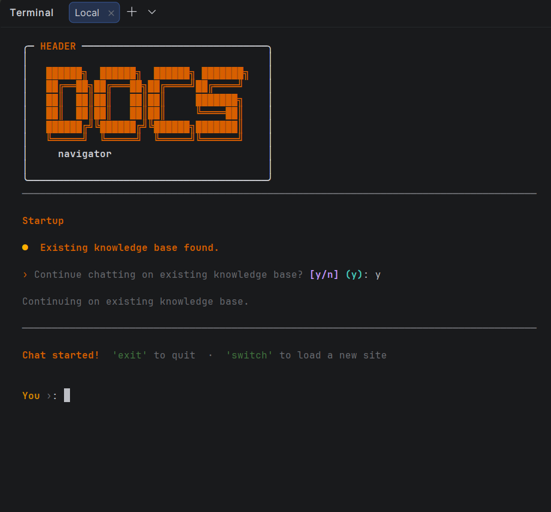

# DocsNavigator

A CLI-based Retrieval-Augmented Generation (RAG) app using LangChain, FAISS, and Ollama.
It crawls website docs, chunks content, builds a local vector index, and answers questions with context retrieval.

## Photos

### Terminal UI



## Required Services

- Python 3.10+ (recommended: 3.11)
- Ollama running locally
- Internet access for crawling documentation URLs

## Suggested Models

- LLM: `llama3.2:3b`
- Embedding model: `nomic-embed-text` (often called "Nomic" embedding model)

## Install

1. Create and activate a virtual environment.
2. Install dependencies:
   - `pip install -r requirements.txt`

## 2 Quick Commands

Run these from the project folder:

```bash
ollama pull llama3.2:3b && ollama pull nomic-embed-text
python llm.py
```

## How It Works

- `loader.py`: Crawls a base URL and subpages, extracts readable page text.
- `ingest.py`: Splits text into chunks, embeds in parallel, saves/merges FAISS index.
- `retriver.py`: Loads FAISS and runs similarity retrieval for query context.
- `chain.py`: Prompt + retrieval wiring for RAG chain.
- `llm.py`: Interactive terminal app (startup, ingest, chat, switch).

## Notes

- If `faiss_index` does not exist, app prompts for a docs URL and builds one.
- To allow unsafe FAISS deserialization (only for trusted local indexes), set:
  - `ALLOW_DANGEROUS_DESERIALIZATION=true`
